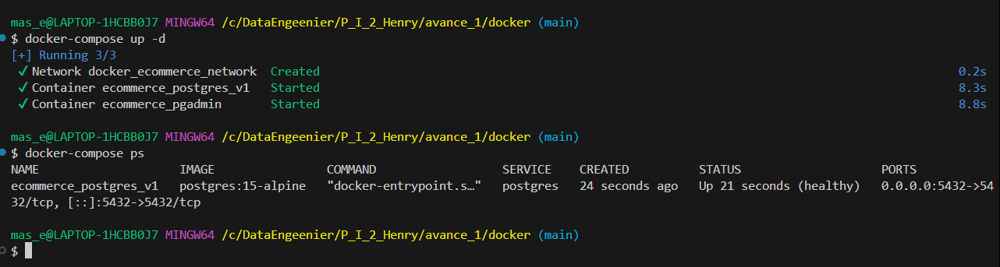
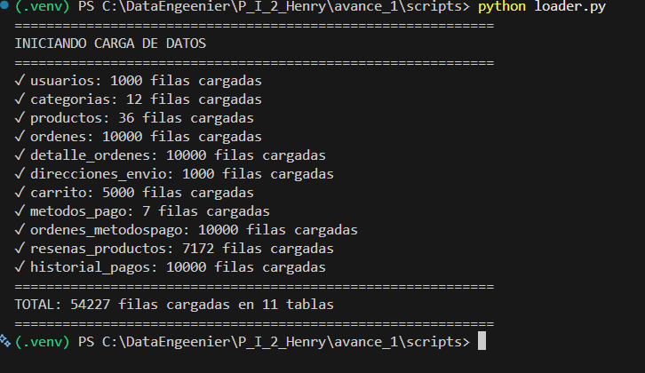

# Avance 1: Carga y Exploración de Datos

## Objetivo
Construir la capa de staging, cargar datos desde 11 CSVs, validar integridad y realizar análisis exploratorio inicial.

## Estructura
```
Avance_1/
├── data/raw/              # 11 archivos CSV
├── docker/
│   ├── docker-compose.yml
│   └── init.sql           # Tablas staging
├── scripts/
│   ├── config.py
│   ├── database.py
│   ├── loader.py          # Carga de CSVs
│   └── __init__.py
├── notebooks/
│   └── 01_EDA_Exploracion.ipynb
├── docs/
│   ├── AVANCE_1_REPORTE.md
│   ├── DICCIONARIO_DATOS.md
│   ├── DIAGRAMA_ER.md
│   └── screenshots/
└── .env
```

## Requisitos
- Docker + Docker Compose
- Python 3.9+
- PostgreSQL 15 (en contenedor)

## Setup Rápido

### 1. Clonar y configurar
```bash
git clone https://github.com/adriangoll/P_I_2_Henry.git
cd P_I_2_Henry/Avance_1
```

### 2. Variables de entorno
```bash
cp .env.example .env
```

### 3. Levantar infraestructura
```bash
cd docker
docker-compose up -d
cd ..
```

Verifica: `docker-compose ps` (2 contenedores UP)



### 4. Crear entorno Python
```bash
python -m venv .venv
.venv\Scripts\activate  # Windows
source .venv/bin/activate  # Linux/Mac
pip install -r requirements.txt
```

### 5. Cargar datos
```bash
cd scripts
python loader.py
```

Output esperado: ~44k registros en 11 tablas ✓



### 6. Análisis exploratorio
```bash
jupyter lab
# Abre: notebooks/01_EDA_Exploracion.ipynb
# Ejecuta todas las celdas
```

## Datos Cargados

| Tabla | Filas | Columnas |
|-------|-------|----------|
| usuarios | 1,000 | 6 |
| categorias | 12 | 3 |
| productos | 36 | 6 |
| ordenes | 10,000 | 5 |
| detalle_ordenes | 10,000 | 4 |
| direcciones_envio | 1,000 | 9 |
| carrito | 5,000 | 5 |
| metodos_pago | 28 | 3 |
| ordenes_metodospago | 10,000 | 4 |
| resenas_productos | 7,172 | 5 |
| historial_pagos | 10,000 | 4 |

**Total: 54,227 registros**

## Acceso a BD

- **PostgreSQL**: `localhost:5432`
- **PgAdmin**: `http://localhost:5050` (admin@ecommerce.local / admin)

Query de ejemplo:
```sql
SELECT COUNT(*) FROM staging.usuarios;
```

## Hallazgos Clave

✓ Carga exitosa sin errores críticos
✓ Integridad referencial validada
✓ Top 10 productos identificados
✓ Métodos de pago: 7 principales
✓ Reseñas: 7,172 (rating promedio: ~3.8/5)

## Próximos Pasos (Avance 2)
- Modelado dimensional (star schema)
- Tablas de hechos y dimensiones
- SCD Type 2 para cambios históricos
- Documentación formal

## Documentación
- `AVANCE_1_REPORTE.md` - Análisis completo
- `DICCIONARIO_DATOS.md` - Descripción columnas
- `DIAGRAMA_ER.md` - Relaciones BD

## Troubleshooting
**Docker no levanta**: `docker-compose down -v && docker-compose up -d`
**Datos no cargan**: Verifica `python loader.py` output
**Jupyter no abre**: `.venv\Scripts\activate && jupyter lab`