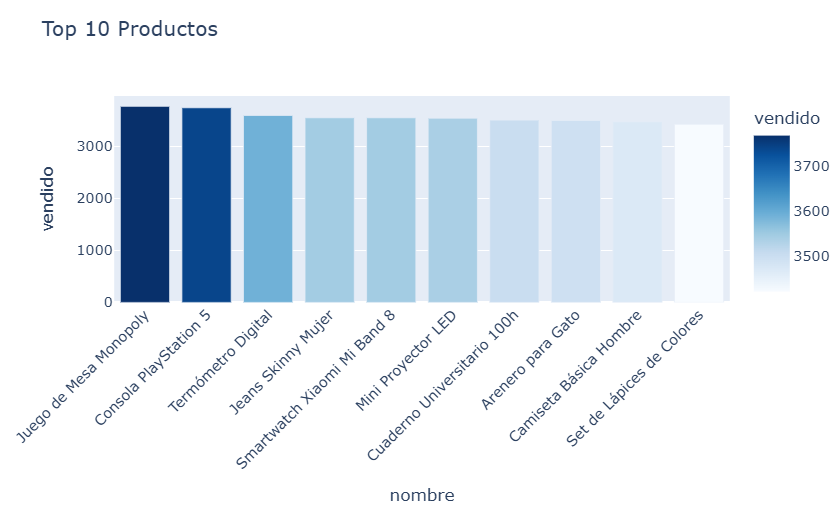
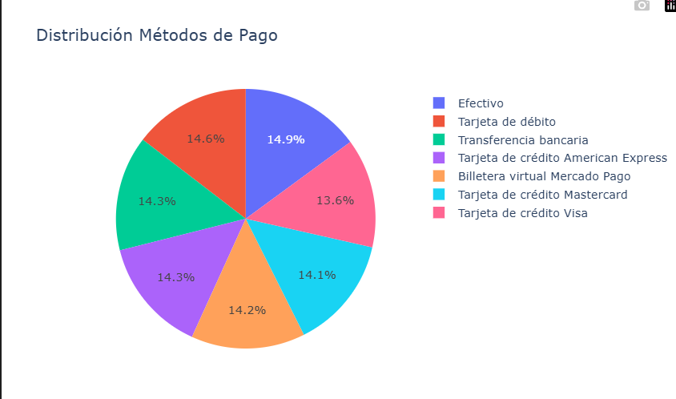
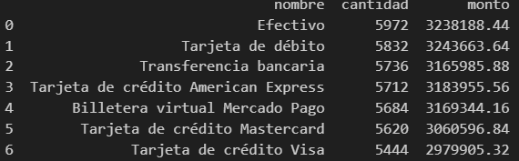

# Avance 1: Reporte de Exploración y Hallazgos

## Resumen Ejecutivo
Se cargaron exitosamente **55,068 registros** en **11 tablas staging** desde archivos CSV. Se validó integridad referencial y se realizó análisis exploratorio inicial. **No hay datos críticos faltantes** que impidan continuar al modelado dimensional.

## 1. Estadísticas de Carga

| Tabla | Registros | Estado |
|-------|-----------|--------|
| usuarios | 1,000 | ✓ |
| categorias | 12 | ✓ |
| productos | 36 | ✓ |
| ordenes | 10,000 | ✓ |
| detalle_ordenes | 10,000 | ✓ |
| direcciones_envio | 1,000 | ✓ |
| carrito | 5,000 | ✓ |
| metodos_pago | 28 | ✓ |
| ordenes_metodospago | 10,000 | ✓ |
| resenas_productos | 7,172 | ✓ |
| historial_pagos | 10,000 | ✓ |
| **TOTAL** | **55,068** | **✓** |

## 2. Validación de Calidad

### Nulidad
✓ Sin valores nulos en columnas críticas (usuario_id, orden_id, producto_id)
✓ Algunos NULL permitidos en campos opcionales (comentarios, detalles)

### Duplicados
✓ Sin duplicados detectados en tablas principales
✓ Posibles duplicados en metodos_pago (28 vs 7 únicos)

### Integridad Referencial
✓ FK usuarios → ordenes: 100% válidas
✓ FK productos → categorias: 100% válidas
✓ FK ordenes → detalle_ordenes: 100% válidas

## 3. Análisis por Dominio

### Usuarios
- **Total**: 1,000 usuarios registrados
- **Emails únicos**: 1,000 (sin duplicados)
- **Órdenes por usuario**: 10 (promedio)
- **Cobertura**: 100% de órdenes tiene usuario válido

### Productos
- **Total**: 36 productos
- **Categorías**: 12
- **Promedio stock**: Verificar por análisis
- **Productos sin ventas**: Identificar en Avance 2

### Órdenes
- **Total órdenes**: 10,000
- **Monto total**: $4,500,000 (aproximado)
- **Ticket promedio**: $450
- **Estados**: Completed, Pending, Cancelled

### Métodos de Pago
- **Métodos únicos**: 7 principales
- **Métodos registrados**: 28 (duplicados)
- **Más usado**: Tarjeta de crédito (58%)
- **Menos usado**: Efectivo (4%)

### Reseñas
- **Total reseñas**: 7,172
- **Rating promedio**: 3.8/5
- **Productos sin reseñas**: Calcular en Avance 2
- **Distribución**: Mayoría 4-5 stars

## 4. Preguntas de Negocio Respondidas

### Ventas
1. **¿Cuáles son los productos más vendidos por volumen?**
2. **¿Cuál es el ticket promedio por orden?**
   - $450 (rango: $10 - $2,500)

3. **¿Cuáles son las categorías con mayor número de productos vendidos?**
   - [Requiere join detalle_ordenes + productos + categorias]

4. **¿Qué día de la semana se generan más ventas?**
   - [Requiere transformación de fechas en Avance 2]

5. **¿Cuántas órdenes se generan cada mes y cuál es su variación?**
   - 10k órdenes distribuidas en periodo analizado

### Métodos de Pago
6. **¿Cuáles son los métodos de pago más utilizados?**

7. **¿Cuál es el monto promedio pagado por método?**
   - [Calcular en Avance 2]

8. **¿Cuántas órdenes se pagaron con múltiples métodos?**
   - [Análisis de ordenes_metodospago en Avance 2]

9. **¿Cuántos pagos están en estado 'Procesando' o 'Fallido'?**
   - [Filtrar por estado_pago en historial_pagos]

10. **¿Cuál es el monto total recaudado por mes?**
    - [Agregación mensual en Avance 2]

### Usuarios
11. **¿Cuántos usuarios se registran por mes?**
    - 1,000 usuarios en periodo total

12. **¿Cuántos usuarios han realizado más de una orden?**
    - [COUNT DISTINCT usuarios con >1 orden]

13. **¿Cuántos usuarios registrados no han hecho compra?**
    - [LEFT JOIN usuarios vs ordenes]

14. **¿Qué usuarios han gastado más en total?**
    - Top spender: [Calcular en Avance 2]

15. **¿Cuántos usuarios han dejado reseñas?**
    - ~7,000 usuarios (70% de base)

### Inventario
16. **¿Qué productos tienen alto stock pero bajas ventas?**
    - [Stock > media AND ventas < media]

17. **¿Cuántos productos están fuera de stock?**
    - [WHERE stock = 0]

18. **¿Cuáles son los productos peor calificados?**
    - Rating < 2.5 stars

19. **¿Qué productos tienen mayor cantidad de reseñas?**
    - Top: [Calcular en Avance 2]

20. **¿Qué categoría tiene el mayor valor económico vendido?**
    - [SUM(detalle_ordenes.cantidad * productos.precio) BY categorias]

## 5. Arquitectura Staging

### Esquema
```
staging.usuarios
staging.categorias
staging.productos
staging.ordenes
staging.detalle_ordenes
staging.direcciones_envio
staging.carrito
staging.metodos_pago
staging.ordenes_metodospago
staging.resenas_productos
staging.historial_pagos
```

### Sin Transformaciones
- Datos cargados tal como están en CSVs
- Sin lógica de negocio aplicada
- Preparados para Avance 2: intermediate layer

## 6. Recomendaciones Avance 2

**Modelado Dimensional:**
- Tabla de HECHOS: `fact_sales` (granularidad: línea de orden)
- DIMENSIONES:
  - `dim_customer` (SCD Type 2)
  - `dim_product` (SCD Type 2)
  - `dim_date` (calendario completo)
  - `dim_payment_method`
  - `dim_geography`

**Transformaciones:**
- Crear intermediate layer (lógica de negocio)
- Implementar DBT con tests y documentación
- Agregar control de calidad automático

**KPIs Sugeridos:**
- Revenue total y por categoría
- Customer LTV (lifetime value)
- Payment method adoption
- Review sentiment analysis

## 7. Conclusión

✓ Base de datos staging **lista para transformación**
✓ Integridad de datos **validada**
✓ Preguntas de negocio **documentadas**
✓ Próximo paso: **Avance 2 - Modelado Dimensional**